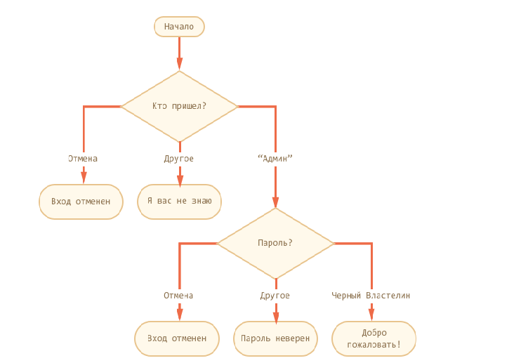

# Домашняя работа

# Читаем информационные ресурсы:
 * https://learn.javascript.ru/switch
 * https://learn.javascript.ru/operators
 * https://developer.mozilla.org/ru/docs/Web/JavaScript/Reference/Operators/typeof
 * http://learn.javascript.ru/external-script
 * https://developer.mozilla.org/ru/docs/Web/JavaScript/Reference/Statements/if...else
 * https://developer.mozilla.org/ru/docs/Web/JavaScript/Reference/Statements/for
 * https://developer.mozilla.org/ru/docs/Web/JavaScript/Reference/Statements/do...while

# Лекция

 1. 
   1.1 Ораганизовать перебор чисел от 1 до 150. 
   1.2 Посчитать сумму всех чисел  
   1.3 Посчитать сумму чётных чисел.
 
2. Заставить пользователя ввести с клавиатуры число.

3.  Реализовать скрипт согласно схеме:
     

4. Посчитать факториал n!, где n - ввести с клавиатуры.

5. Ввести с клавиатуры 2 числа `a` и `b` (где `a <<< b`). Запустить цикл перебора от `a` до `b`. Вывести в консоль квадраты чётных чисел.

6. (**)Проверить число на простоту. Число вводить с клавиатуры.